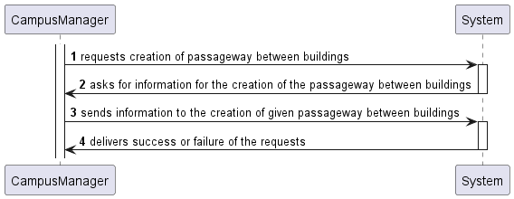
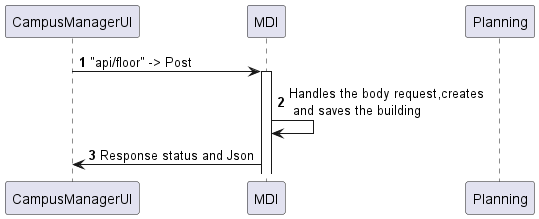
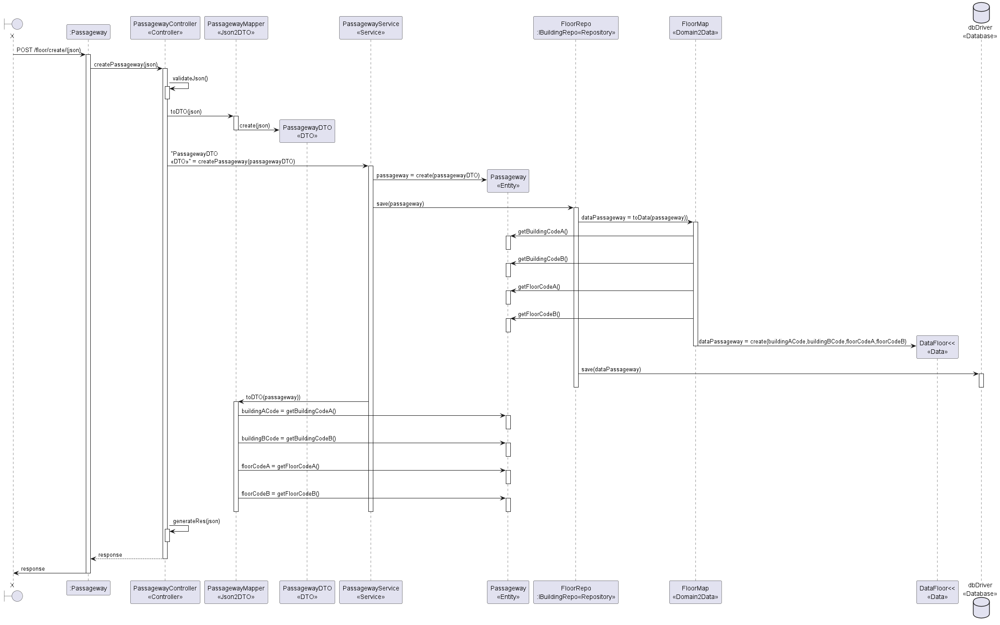

# US 240

## Criar passagem entre edifícios

## 1. Requisitos

### 1.1. Critérios de aceitação do cliente

* Um edifício pode ter ligação a mais do que um edifício.

### 1.3 Questões realizadas

Questão:

    Caro cliente,

    No mesmo edifício é possível ter duas passagens para outro edifício, em pisos diferentes?

    Por exemplo, do edifício B existir uma passagem para o edifício G no piso 2 e outra no piso 3 também para o G.

Resposta:

    Bom dia,

    sim, em cada piso podem existir várias passagens, cada uma para outro edifício, e no mesmo edifício podem existir várias passagens para um outro edifício desde que em pisos diferentes.

### 1.4 Dependências

  Para criar uma passagem, precisamos de ter os edifícios em causa criados anteriormente e com menção aos pisos.
## 2. Análise

### 2.1 Passagem
```json
{
  "buildingCodeA": "A",
  "buildingCodeB": "B",
  "floorCodeA": "floorA",
  "floorCodeB": "floorB"
}
```
## 3. Design

### 3.1. Diagrama de Sequência

### 3.1.1 Diagrama de Sequência Layer 1

### 3.1.2 Diagrama de Sequência Layer 2

### 3.1.3 Diagrama de Sequência Layer 3



### 3.2. Estrutura dos pedidos e das respostas
Estrutura dos pedidos
```json
{
"buildingCodeA": "A",
"buildingCodeB": "B",
"floorCodeA": "floorA",
"floorCodeB": "floorB"
}
```

Estrutura das respostas
```json
{
  "id": "3d7b2d3b-f605-4c36-bda3-c824b63bd8bc",
  "buildingCodeA": "A",
  "buildingCodeB": "B",
  "floorCodeA": "floorA",
  "floorCodeB": "floorB"
}
```

### 3.3. Testes
```

```

## 4. Integração
PassagewayService

      public async createPassageway(passagewayDTO: IPassagewayDTO): Promise<Result<IPassagewayDTO>> {
      try {
      const buildingA = await this.buildingRepo.findByCode(passagewayDTO.buildingACode);
      const buildingB = await this.buildingRepo.findByCode(passagewayDTO.buildingBCode);

      if (!buildingA || !buildingB) {
        return Result.fail<IPassagewayDTO>('One or both buildings not found.');
      }

      // For buildingA:
      if (
        passagewayDTO.locationA.x > buildingA.buildingSize.width ||
        passagewayDTO.locationA.y > buildingA.buildingSize.length
      ) {
        return Result.fail<IPassagewayDTO>('Coordinates for Building A are outside of its boundaries.');
      }

      // For buildingB:
      if (
        passagewayDTO.locationB.x > buildingB.buildingSize.width ||
        passagewayDTO.locationB.y > buildingB.buildingSize.length
      ) {
        return Result.fail<IPassagewayDTO>('Coordinates for Building B are outside of its boundaries.');
      }
      const passagewayOrError = await Passageway.create(passagewayDTO);

      if (passagewayOrError.isFailure) {
        return Result.fail<IPassagewayDTO>(passagewayOrError.errorValue());
      }

      const passagewayResult = passagewayOrError.getValue();
      await this.passagewayRepo.save(passagewayResult);

      const passagewayDTOResult = PassagewayMap.toDTO(passagewayResult) as IPassagewayDTO;
      return Result.ok<IPassagewayDTO>(passagewayDTOResult);
    } catch (e) {
      throw e;
    }

PassagewayController

    public async createPassageway(req: Request, res: Response, next: NextFunction) {
    try {
      const passagewayOrError = (await this.passagewayServiceInstance.createPassageway(
        req.body as IPassagewayDTO,
      )) as Result<IPassagewayDTO>;

      if (passagewayOrError.isFailure) {
        return res
          .status(400)
          .json(passagewayOrError.error)
          .send();
      }

      const passagewayDTO = passagewayOrError.getValue();
      return res.json(passagewayDTO).status(201);
    } catch (e) {
      console.error('Error in createPassageway:', e);
      return next(e);
    }


## 5. Observações
