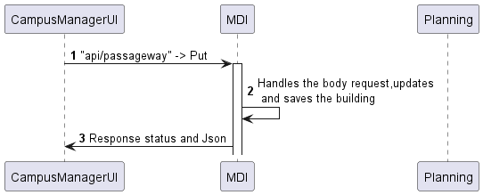

# US 250

## Editar passagem entre edifícios

## 1. Requisitos

### 1.1. Critérios de aceitação do cliente

* Um edifício pode ter ligação a mais do que um edifício.

### 1.3 Questões realizadas

Questão:

    Olá,

    relativamente à US250 o que é que pretende que seja possivel editar numa passagem entre edificios?

Resposta:

    bom dia,

    apenas os edificios e os pisos que estão ligados por essa passagem

### 1.4 Dependências

  Para editar uma passagem, precisamos de ter uma passagem criada anteriormente.

## 2. Análise

### 2.1 Passagem
```json
{
  "buildingCodeA": "A",
  "buildingCodeB": "B",
  "floorCodeA": "floorA",
  "floorCodeB": "floorB"
}
```
## 3. Design

### 3.1. Diagrama de Sequência

### 3.1.1 Diagrama de Sequência Layer 1

### 3.1.2 Diagrama de Sequência Layer 2

### 3.1.3 Diagrama de Sequência Layer 3


### 3.2. Estrutura dos pedidos e das respostas
Estrutura dos pedidos
```json
{
  "buildingACode": "CODEA",
  "buildingBCode": "CODEB",
  "buildingAFloor": 1,
  "buildingBFloor": 2,
  "locationA": {
    "x": 10,
    "y": 20
  },
  "locationB": {
    "x": 30,
    "y": 40
  }
}
```
```json
{
  "id": "3d7b2d3b-f605-4c36-bda3-c824b63bd8bc",
  "buildingACode": "CODEA",
  "buildingBCode": "CODEB",
  "buildingAFloor": 1,
  "buildingBFloor": 2,
  "locationA": {
    "x": 10,
    "y": 20
  },
  "locationB": {
    "x": 30,
    "y": 40
  }
}
```

## 4. Integração
PassagewayController

    public async updatePassageway(req: Request, res: Response, next: NextFunction) {
    try {
      const passagewayOrError = (await this.passagewayServiceInstance.updatePassageway(
        req.body as IPassagewayDTO,
      )) as Result<IPassagewayDTO>;

      if (passagewayOrError.isFailure) {
        return res
          .status(400)
          .json(passagewayOrError.error)
          .send();
      }

      const passagewayDTO = passagewayOrError.getValue();
      return res.status(200).json(passagewayDTO);
    } catch (e) {
      return next(e);
    }

PassagewayService

    public async updatePassageway(passagewayDTO: IPassagewayDTO): Promise<Result<IPassagewayDTO>> {
    try {
      // Make sure the buildings exist
      const buildingA = await this.buildingRepo.findByCode(passagewayDTO.buildingACode);
      const buildingB = await this.buildingRepo.findByCode(passagewayDTO.buildingBCode);

      if (!buildingA || !buildingB) {
        return Result.fail<IPassagewayDTO>('One or both buildings not found.');
      }

      // Check if coordinates are inside the building
      if (
        passagewayDTO.locationA.x > buildingA.buildingSize.width ||
        passagewayDTO.locationA.y > buildingA.buildingSize.length
      ) {
        return Result.fail<IPassagewayDTO>('Coordinates for Building A are outside of its boundaries.');
      }

      if (
        passagewayDTO.locationB.x > buildingB.buildingSize.width ||
        passagewayDTO.locationB.y > buildingB.buildingSize.length
      ) {
        return Result.fail<IPassagewayDTO>('Coordinates for Building B are outside of its boundaries.');
      }

      // Check if passageway already exists
      const existingPassageway = await this.passagewayRepo.findByBuildingCodes(
        passagewayDTO.buildingACode,
        passagewayDTO.buildingBCode,
      );

      if (!existingPassageway) {
        return Result.fail<IPassagewayDTO>('Passageway not found');
      } else {
        const buildingACodeOrError = BuildingCode.create(passagewayDTO.buildingACode);
        const buildingBCodeOrError = BuildingCode.create(passagewayDTO.buildingBCode);
        const floorAOrError = FloorNumber.create(passagewayDTO.floorA);
        const floorBOrError = FloorNumber.create(passagewayDTO.floorB);
        const locationAOrError = Location.create(passagewayDTO.locationA.x, passagewayDTO.locationA.y);
        const locationBOrError = Location.create(passagewayDTO.locationB.x, passagewayDTO.locationB.y);

        if (buildingACodeOrError.isFailure || buildingBCodeOrError.isFailure) {
          return Result.fail<IPassagewayDTO>('Invalid building code(s)');
        }

        if (floorAOrError.isFailure || floorBOrError.isFailure) {
          return Result.fail<IPassagewayDTO>('Invalid floor number(s)');
        }

        existingPassageway.updateBuildingACode(buildingACodeOrError.getValue());
        existingPassageway.updateBuildingBCode(buildingBCodeOrError.getValue());
        existingPassageway.updateFloorA(floorAOrError.getValue());
        existingPassageway.updateFloorB(floorBOrError.getValue());
        existingPassageway.updateLocationA(locationAOrError.getValue());
        existingPassageway.updateLocationB(locationBOrError.getValue());
      }

      // Save passageway using repo
      await this.passagewayRepo.update(existingPassageway);

      const updatedPassagewayDTO = PassagewayMap.toDTO(existingPassageway) as IPassagewayDTO;
      return Result.ok<IPassagewayDTO>(updatedPassagewayDTO);
    } catch (e) {
      throw e;
    }
}

## 5. Observações
