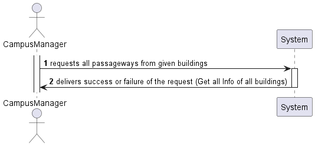
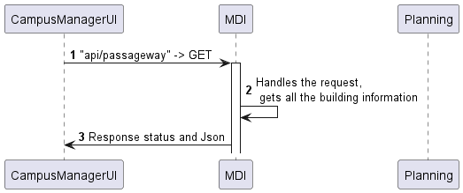
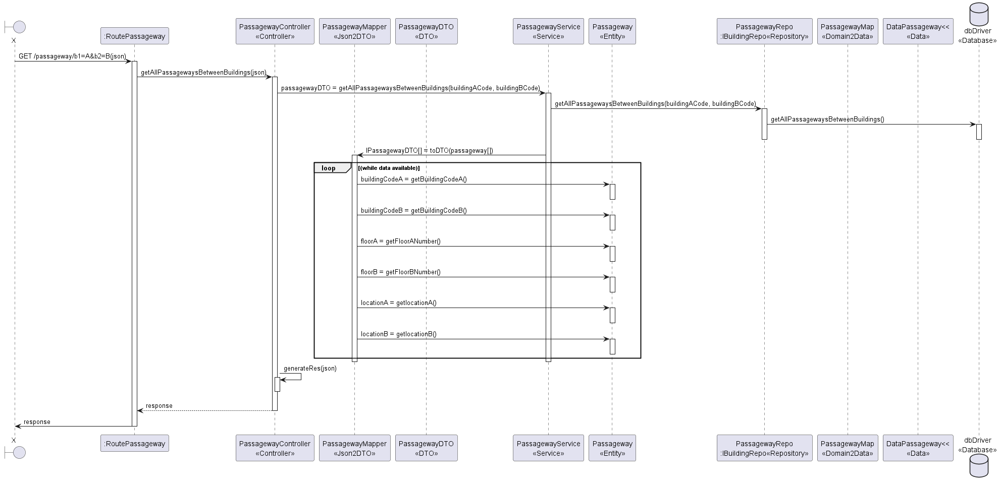

# US 260

## Listar passagens entre edifícios

## 1. Requisitos

### 1.1. Critérios de aceitação do cliente

---

### 1.3 Questões realizadas

---

### 1.4 Dependências

  Precisamos de passagens criadas previamente para poder listá-las (US240).


## 3. Design

### 3.1. Diagrama de Sequência

### 3.1.1 Diagrama de Sequência Layer 1

### 3.1.2 Diagrama de Sequência Layer 2

### 3.1.3 Diagrama de Sequência Layer 3



### 3.2. Estrutura dos pedidos e das respostas
Estrutura dos pedidos
```json
  GET: http://localhost:4000/api/passageway/?buildingACode=B&buildingBCode=C
```

```
Estrutura das respostas

[
  {
    "buildingACode": "B",
    "buildingBCode": "C",
    "floorA": 1,
    "floorB": 1,
    "locationA": {
      "x": 3,
      "y": 1
    },
    "locationB": {
      "x": 3,
      "y": 1
    }
  },
  {
    "buildingACode": "B",
    "buildingBCode": "C",
    "floorA": 1,
    "floorB": 1,
    "locationA": {
      "x": 1,
      "y": 2
    },
    "locationB": {
      "x": 1,
      "y": 1
    }
  }
]

```

## 4. Integração
PassagewayController

    public async updatePassageway(req: Request, res: Response, next: NextFunction) {
    try {
      const passagewayOrError = (await this.passagewayServiceInstance.updatePassageway(
        req.body as IPassagewayDTO,
      )) as Result<IPassagewayDTO>;

      if (passagewayOrError.isFailure) {
        return res
          .status(400)
          .json(passagewayOrError.error)
          .send();
      }

      const passagewayDTO = passagewayOrError.getValue();
      return res.status(200).json(passagewayDTO);
    } catch (e) {
      return next(e);
    }

PassagewayService

    public async getAllPassagewaysBetweenBuildings(
    buildingACode: string,
    buildingBCode: string,
    ): Promise<Result<Array<IPassagewayDTO>>> {
    return await this.passagewayRepo.getAllPassagewaysBetweenBuildings(buildingACode, buildingBCode);
    }

## 5. Observações
