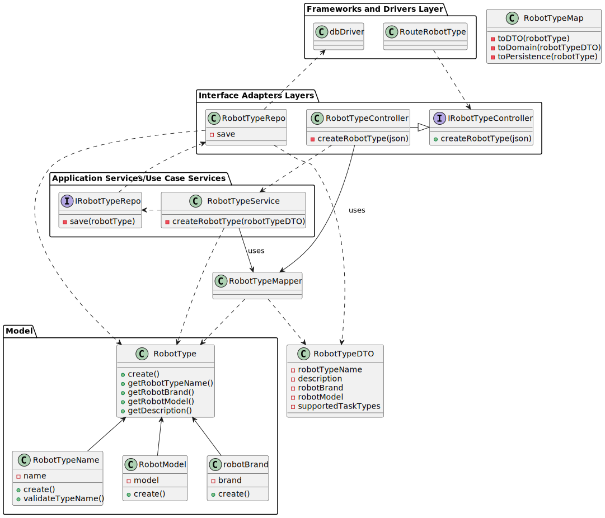

# US350 - LAP-18

## Criar um tipo de Robot

## 1. Requisitos

### 1.1. Critérios de aceitação do cliente

* **tipo de robot:** obrigatório, alfanuméricos, maximo 25 caracteres
* **marca:** obrigatório, maximo 50 caracteres
* **modelo:** obrigatório, máximo 100 caracteres

### 1.2 Caderno de encargos

"Considere que o ISEP adquire robots de dois tipos:

**robisep**: 
* robot móvel que se movimenta através de um sistema de rodas podendo
deslocar-se nos corredores dos edifícios ou através de elevadores entre pisos de um
edifício, mas não consegue subir escadas. O robot pode ir de um edifício para outro, mas
só através dos corredores cobertos de ligação entre edifícios.
* Os robiseps podem ter
instalados sistemas que efetuam diversas tarefas, tais como vigilância ou limpeza do
corredor ou ainda acesso a uma sala/gabinete para buscar/entregar um item (por
exemplo, um comando de um projetor ou uma caneta para quadro branco).

 **droneisep**: 
 * drone que se movimenta no espaço exterior aos edifícios existentes no ISEP.
* O droneisep pode ir de um ponto para outro ponto do espaço deslocando-se através de
trajetos em linha reta permitidos. As tarefas desses drones poderão ser várias, tais como
fazer entregas de objetos, vigilância, aquisições de imagem, operações de limpeza de
janelas exteriores, etc."

### 1.3 Questões realizadas

Questão: 

    Bom dia,

    Relativamente à US350 foi referido numa resposta anterior "o requisito 350 permite definir que tipos de robots existem. por exemplo "Tipo A: Robot marca X modelo Y com capacidade de executar tarefas de vigilância"

    Pretende alguma regra de negócio para o limite de caracteres para o tipo, marca e modelo?

    Cumprimentos

Resposta:

    bom dia,

    tipo de robot: obrigatório, alfanum+ericos, maximo 25 caracteres
    marca: obrigatório, maximo 50 caracteres
    modelo: obrigatório, máximo 100 caracteres

Questão: 

    Boa tarde,
    
    Poderia explicar as diferenças entre estas duas user stories, US350 e US360?

Resposta:

    boa tarde,
    o requisito 360 permite definir que tipos de robots existem. por exemplo "Tipo A: Robot marca X modelo Y com capacidade de executar tarefas de vigilância" e "Tipo B: Robot marca W modelo Z com capacidade de executar tarefas de vigilância e pickeup&delivery"

    o requisito 370 permite indicar que robots existem e de que tipo cada um é, por exemplo "Robot 'ABC32' do tipo A", "Robot 'Brian2' do tipo A" e "Robot 'Stew' do tipo B"

Questão: 


    Olá,

    pode, por favor, explicar um pouco melhor?
    A US 350 (Como gestor de frota pretendo adicionar um novo tipo de robot indicando a sua designação e que tipos de tarefas pode executar da lista prédefinida de tarefas) - adicionar um tipo é indicar qual é a marca, o modelo e as tarefas que pode desempenhar um robot?

    A US 360 (Como gestor de frota pretendo adicionar um novo robot à frota indicando o seu tipo, designação, etc.) é associar as caracteristicas de um tipo a um robot?

    Pode, por favor, clarificar as diferenças entre estas duas US? Obrigada

Resposta:

    bom dia,
    no requisito 350 definimos tipos de robots e no requisito 360 definimos robots desses tipos.
    se ajudar, fica aqui uma analogia.

    definir tipos de viaturas:
    tipo 1: renault clio 5 portas gasolina
    tipo 2: renault megane 5 portas diesel
    definir viaturas
    viatura com matricula AA-00-01 do tipo 1
    viatura com matricula BB-10-CC do tipo 2

Questão: 

    Bom dia estimando cliente,

    A minha dúvida é em relação às tarefas e às suas definições.

    Existem diferentes tipos de tarefas, por isso, cada uma terá os seus atributos. No entanto, que atributos definem uma tarefa em geral? Apenas a sua designação?

    Em relação às tarefas existentes (vigilância de um piso e transporte de um objeto) existem algum requerimento especial? Para além da especificação do piso na vigilância e especificação do objeto e local de recolha e entrega no caso do transporte.

    Obrigado em avanço.

Resposta:

    Boa tarde,
    de momento todos os robots da frota apenas suportam estes dois tipos de tarefas. a existirem novos tipos de tarefas será necessáiro desenvolvimento especifico para tal. Em consequência não existem "tarefas em geral"

    As tarefas de vigilância caracterizam-se por indicar qual o edificio e piso(s) que se pretende vigiar bem como o número de contacto em caso de incidente. tipicamente o segurança irá requisitar que um robot "dê uma volta pelos pisos X, Y e Z do edificio N". Caso o robot detete alguma situação anómala, o robot irá enviar um SMS para o contacto indicado (*)

    As tarefas de "piclup & delivery" caracterizam-se por indicar qual a sala que se pretende de pickup e qual a sala de delivery, bem como um nome e um contacto para pickup e outro para delivery. deve também ser indicado um código de confirmação que a pessoa que receberá deverá introduzir no painel do robot. adicionalmente deve ser indicada uma descrição da entrega, ex., "Marcadores de cor vermelha (1x) e azul (2x)"

    (*) fora do âmbito do protótipo

Questão: 

    Bom dia,

    Relativamente as restrições indicadas para o campo "tipo de robot", este campo indica o tipo de tarefa executada por um robot (pickup&delivery e/ou vigilancia) ou um atributo do tipo nome do tipo do robot, e existe outro campo para o tipo de tarefa executado por esse tipo de robot?

Resposta:

    bom dia,
    o "tipo de robot" é um código identificativo desse tipo de robots. a lista de capacidades do robot é uma informação diferente


### 1.4 Dependências

Esta User Story não tem nenhuma dependência a nenhuma outra

## 2. Análise

### 2.1 Robot

## 3. Design

### 3.1. Diagrama de sequência
### 3.1.1 Diagrama de Sequência Layer 1

### 3.1.2 Diagrama de Sequência Layer 2

### 3.1.3 Diagrama de Sequência Layer 3


### 3.2. Diagrama de classes



### 3.3. Estrutura dos pedidos e das respostas

Pedido:

```json
{
  "robotTypeName": "string (required)",
  "description": "string (optional)",
  "robotBrand": "string (required)",
  "robotModel": "string (required)",
  "supportedTaskTypes": "array",
}

```

Resposta [200]:

```json
{
    "robotTypeName": "ExampleName",
    "robotBrand": "ExampleBrand",
    "robotModel": "ExampleModel",
    "supportedTaskTypes": []
}
```

Resposta [400]:
```json
{
    "errors": {
        "message": "child \"taskTypeNames\" fails because [\"robotBrand\" is required]"
    }
}
```

### 3.4. Testes

## 4. Implementação

## 5. Integração

## 6. Observações