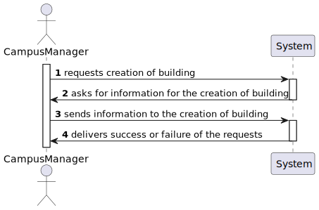
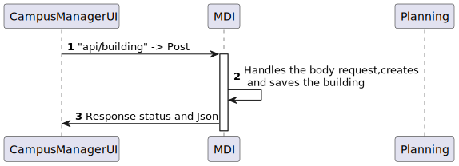
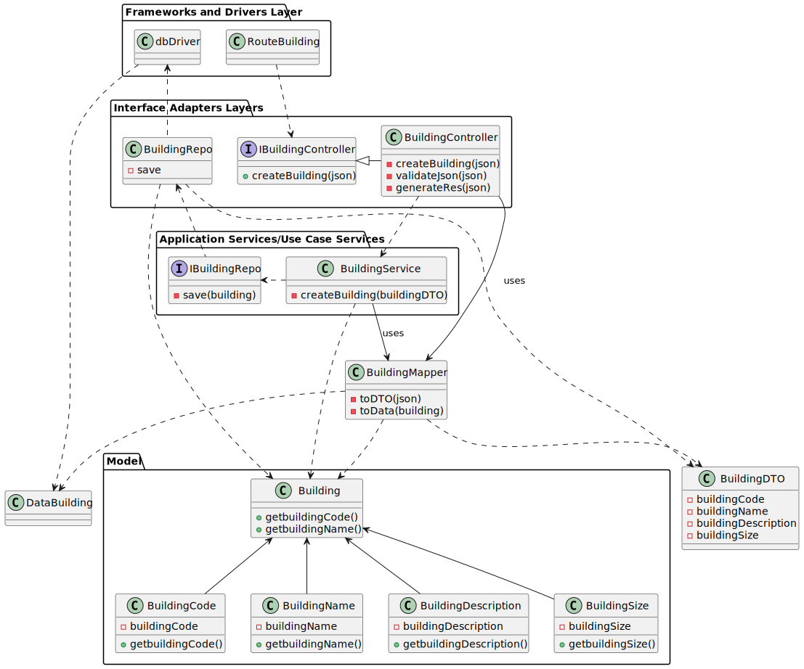

# US 150

## Criar um edifício

## 1. Requisitos

### 1.1. Critérios de aceitação do cliente

* O código é obrigatório e deverá ter, no máximo 5 caracteres, letras, digitos, onde pode conter espaçoes no meio.
* O nome do edificio é opcional, no máximo 50 caracteres alfanuméricos

### 1.2 Caderno de encargos

"O mapa do campus descreve os edifícios existentes"

### 1.3 Questões realizadas

Questão:

    Caro cliente,

    O nome do edifício tem limitações como, por exemplo, tem de ter uma letra e números? E para além do nome do edifício, que mais informação deve ser guardada sobre o edifício.

Resposta:

    boa tarde
    ver https://moodle.isep.ipp.pt/mod/forum/discuss.php?d=25016#p31679

    o código do edificio é obrigatório, no máximo 5 caracteres, letras e digitos, podendo conter espaços no meio
    o nome do edificio é opcional, no máximo 50 caracteres alfanuméricos

Questão:

    Caro cliente,

    Relativamente à criação de edifícios é suposto criar-mos um edifício sem nenhum piso inicialmente e depois adicionarmos os pisos?

    Por exemplo: Criar o edifício A apenas, sem nenhum piso, e só depois na US 190 criar-mos os respetivos pisos do edifício A.

    Ou é necessário sempre que criarmos um edifício especificar os pisos que o mesmo tem?

    Por exemplo: Criar o edifício A, com os pisos A1, A2, A3 com as dimensões da grelha para cada um dos pisos.

Resposta:

    boa tarde,
    são dois requisitos independentes. 150 apenas define o edificio. posteriormente o utilizador invocará o caso de uso correspondete ao requisito 190 para criar cada piso desse edificio

### 1.4 Dependências

Esta User Story não tem nenhuma dependência a nenhuma outra

## 2. Análise

### 2.1 Edifício
```json
{
  "buildingCode": "B",
  "buildingName": "ISEPB",
  "buildingDescription": "Building B",
  "buildingSize": {
    "width": 100,
    "length": 150
  }
}
```
## 3. Design

### 3.1. Diagrama de Sequência

### 3.1.1 Diagrama de Sequência Layer 1

### 3.1.2 Diagrama de Sequência Layer 2

### 3.1.3 Diagrama de Sequência Layer 3


### 3.2. Diagrama de classes



### 3.3. Estrutura dos pedidos e das respostas
Estrutura dos pedidos
```json
{
  "buildingCode": "B",
  "buildingName": "ISEPB",
  "buildingDescription": "Building B",
  "buildingSize": {
    "width": 100,
    "length": 150
  }
}
```

Estrutura das respostas
```json
{
  "id": "3d7b2d3b-f605-4c36-bda3-c824b63bd8bc",
  "buildingCode": "B",
  "buildingName": "ISEPB",
  "buildingDescription": "Building B",
  "buildingSize": {
    "width": 100,
    "length": 150
  }
}
```


### 3.4. Testes
BuildingSizeTest
```
import { BuildingSize } from '../../../src/domain/building/BuildingSize';

describe('BuildingSize', () => {
describe('create', () => {
it('should return a failure result when width or length are non-positive', () => {
const nonPositiveWidth = BuildingSize.create(-1, 10);
const nonPositiveLength = BuildingSize.create(10, 0);

      expect(nonPositiveWidth.isFailure).toBeTruthy();
      expect(nonPositiveLength.isFailure).toBeTruthy();
    });

    it('should return a success result when width and length are positive', () => {
      const validBuildingSize = BuildingSize.create(10, 20);
      expect(validBuildingSize.isSuccess).toBeTruthy();
    });
});

describe('width and length getters and setters', () => {
it('should throw an error when setting non-positive width or length', () => {
const buildingSizeResult = BuildingSize.create(10, 20);
if (buildingSizeResult.isFailure) {
throw new Error('Test setup failed: could not create BuildingSize');
}
const buildingSize = buildingSizeResult.getValue();

      expect(() => {
        buildingSize.width = -1;
      }).toThrow('Width should be a positive value');
      expect(() => {
        buildingSize.length = 0;
      }).toThrow('Length should be a positive value');
    });
});
});
```


BuildingNameTest
```
import BuildingName from '../../../src/domain/building/BuildingName';

describe('BuildingName', () => {
  describe('create', () => {
    it('should return a failure result when name is null or undefined', () => {
      const nullName = BuildingName.create(null as any);
      const undefinedName = BuildingName.create(undefined as any);

      expect(nullName.isFailure).toBeTruthy();
      expect(undefinedName.isFailure).toBeTruthy();
    });

    it('should return a failure result when name is invalid', () => {
      const invalidName = BuildingName.create('Invalid@Name');
      expect(invalidName.isFailure).toBeTruthy();
    });

    it('should return a success result when name is valid', () => {
      const validName = BuildingName.create('Valid Name 123');
      expect(validName.isSuccess).toBeTruthy();
    });
  });

  describe('validateName', () => {
    it('should return false when name contains special characters', () => {
      const isValid = (BuildingName as any).validateName('Invalid@Name');
      expect(isValid).toBeFalsy();
    });

    it('should return true when name is alphanumeric and spaces only, and 1 to 50 characters long', () => {
      const isValid = (BuildingName as any).validateName('Valid Name 123');
      expect(isValid).toBeTruthy();
    });

    it('should return false when name is empty', () => {
      const isValid = (BuildingName as any).validateName('');
      expect(isValid).toBeFalsy();
    });

    it('should return false when name is longer than 50 characters', () => {
      const longName = 'a'.repeat(51);
      const isValid = (BuildingName as any).validateName(longName);
      expect(isValid).toBeFalsy();
    });
  });
});
```


BuildingDescriptionTest
```
import BuildingDescription from '../../../src/domain/building/BuildingDescription';

describe('BuildingDescription', () => {
  describe('create', () => {
    it('should return a failure result when description is null or undefined', () => {
      const nullDescription = BuildingDescription.create(null as any);
      const undefinedDescription = BuildingDescription.create(undefined as any);

      expect(nullDescription.isFailure).toBeTruthy();
      expect(undefinedDescription.isFailure).toBeTruthy();
    });

    it('should return a failure result when description is invalid', () => {
      const invalidDescription = BuildingDescription.create('Invalid@Description');
      expect(invalidDescription.isFailure).toBeTruthy();
    });

    it('should return a success result when description is valid', () => {
      const validDescription = BuildingDescription.create('Valid Description 123');
      expect(validDescription.isSuccess).toBeTruthy();
    });
  });

  describe('validateDescription', () => {
    it('should return false when description contains special characters', () => {
      const isValid = (BuildingDescription as any).validateDescription('Invalid@Description');
      expect(isValid).toBeFalsy();
    });

    it('should return true when description is alphanumeric and spaces only', () => {
      const isValid = (BuildingDescription as any).validateDescription('Valid Description 123');
      expect(isValid).toBeTruthy();
    });

    it('should return true when description is empty', () => {
      const isValid = (BuildingDescription as any).validateDescription('');
      expect(isValid).toBeTruthy();
    });

    it('should return false when description is longer than 255 characters', () => {
      const longDescription = 'a'.repeat(256);
      const isValid = (BuildingDescription as any).validateDescription(longDescription);
      expect(isValid).toBeFalsy();
    });
  });
});

```
## 4. Implementação
BuildingController
```
export default class BuildingController
implements IBuildingController /* TODO: extends ../core/infra/BaseController */ {
constructor(@Inject(config.services.building.name) private buildingServiceInstance: IBuildingService) {}

public async createBuilding(req: Request, res: Response, next: NextFunction) {
try {
const buildingOrError = (await this.buildingServiceInstance.createBuilding(req.body as IBuildingDTO)) as Result<
IBuildingDTO
>;

      if (buildingOrError.isFailure) {
        return res.status(402).send();
      }

      const buildingDTO = buildingOrError.getValue();
      return res.json(buildingDTO).status(201);
    } catch (e) {
      console.error('Error in createBuilding:', e);
      return next(e);
    }
  }
}
```

BuildingService
```
export default class BuildingService implements IBuildingService {
  constructor(@Inject(config.repos.building.name) private buildingRepo: IBuildingRepo) {}


  public async getBuilding(buildingId: string): Promise<Result<IBuildingDTO>> {
    try {
      const building = await this.buildingRepo.findByDomainId(buildingId);

      if (building === null) {
        return Result.fail<IBuildingDTO>('Building not found');
      } else {
        const buildingDTOResult = BuildingMap.toDTO(building) as IBuildingDTO;
        return Result.ok<IBuildingDTO>(buildingDTOResult);
      }
    } catch (e) {
      throw e;
    }
  }

  public async getBuildingByCode(buildingDTO: IBuildingDTO): Promise<Result<IBuildingDTO>> {
    try {
      const building = await this.buildingRepo.findByCode(buildingDTO.buildingCode);

      if (building === null) {
        return Result.fail<IBuildingDTO>('Building not found');
      } else {
        const buildingDTOResult = BuildingMap.toDTO(building) as IBuildingDTO;
        return Result.ok<IBuildingDTO>(buildingDTOResult);
      }
    } catch (e) {
      throw e;
    }
  }

  //make by code
  public async createBuilding(buildingDTO: IBuildingDTO): Promise<Result<IBuildingDTO>> {
    try {
      const buildingOrError = await Building.create(buildingDTO);

      if (buildingOrError.isFailure) {
        return Result.fail<IBuildingDTO>(buildingOrError.errorValue());
      }

      const buildingResult = buildingOrError.getValue();

      await this.buildingRepo.save(buildingResult);

      const buildingDTOResult = BuildingMap.toDTO(buildingResult) as IBuildingDTO;
      return Result.ok<IBuildingDTO>(buildingDTOResult);
    } catch (e) {
      throw e;
    }
  }

}

```

## 5. Integração

## 6. Observações
