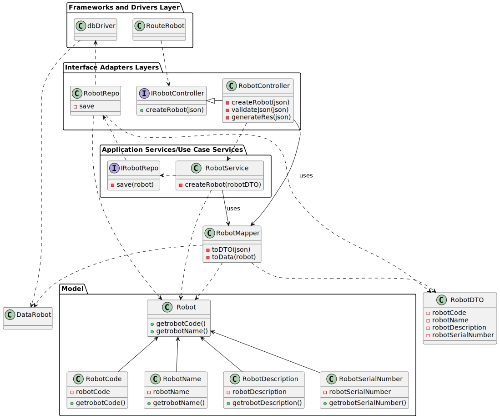

# US360 - LAP-19

## Criar um Robot para adicionar à frota

## 1. Requisitos

### 1.1. Critérios de aceitação do cliente

* **código identificativo** obrigatório, alfanumerico, max 30 caracteres, único no sistema
* **nickname** obrigatório, alfanumerico, max 30 caracteres, único no sistema 
* **tipo de robot** obrigatório
* **número de série** obrigatório, alfanumerico, max 50 caracteres, único para um dado tipo de robot
* **descrição** opcional, alfanumerico, max. 250 caracteres


### 1.2 Caderno de encargos

"A solução pretendida deve permitir que o gestor de frota configure os robots e drones existentes
para que possam mais tarde ser utilizados na execução de tarefas.
Os utentes do campus podem registar-se no sistema para requisitar tarefas a serem executadas
pelos robots e drones. Por exemplo, um docente pode registar-se no sistema e requisitar a entrega de canetas de quadro branco no seu gabinete. O sistema avaliará o pedido e escalonará a sua execução."

### 1.3 Questões realizadas

Questão: 

    Caro cliente,
    Os atributos do robot têm algum tipo de formatação/restrição?
    Obrigado pela sua atenção,
    Grupo 3

Resposta:

    bom dia,
    código identificativo, obrigatório, alfanumerico, max 30 caracteres, único no sistema
    nickname, obrigatório, obrigatório, alfanumerico, max 30 caracteres, único no sistema 
    tipo de robot, obrigatório
    número de série, obrigatório, alfanumerico, max 50 caracteres, único para um dado tipo de robot
    descrição, opcional, alfanumerico, max. 250 caracteres

Questão: 

    Boa tarde,
    
    Poderia explicar as diferenças entre estas duas user stories, US350 e US360?

Resposta:

    boa tarde,
    o requisito 360 permite definir que tipos de robots existem. por exemplo "Tipo A: Robot marca X modelo Y com capacidade de executar tarefas de vigilância" e "Tipo B: Robot marca W modelo Z com capacidade de executar tarefas de vigilância e pickeup&delivery"

    o requisito 370 permite indicar que robots existem e de que tipo cada um é, por exemplo "Robot 'ABC32' do tipo A", "Robot 'Brian2' do tipo A" e "Robot 'Stew' do tipo B"

Questão: 


    Olá,

    pode, por favor, explicar um pouco melhor?
    A US 350 (Como gestor de frota pretendo adicionar um novo tipo de robot indicando a sua designação e que tipos de tarefas pode executar da lista prédefinida de tarefas) - adicionar um tipo é indicar qual é a marca, o modelo e as tarefas que pode desempenhar um robot?

    A US 360 (Como gestor de frota pretendo adicionar um novo robot à frota indicando o seu tipo, designação, etc.) é associar as caracteristicas de um tipo a um robot?

    Pode, por favor, clarificar as diferenças entre estas duas US? Obrigada

Resposta:

    bom dia,
    no requisito 350 definimos tipos de robots e no requisito 360 definimos robots desses tipos.
    se ajudar, fica aqui uma analogia.

    definir tipos de viaturas:
    tipo 1: renault clio 5 portas gasolina
    tipo 2: renault megane 5 portas diesel
    definir viaturas
    viatura com matricula AA-00-01 do tipo 1
    viatura com matricula BB-10-CC do tipo 2

### 1.4 Dependências

Esta User Story tem dependencia com a US350, uma vez que é necessário um robotType para criar um robot.

## 2. Análise

### 2.1 Robot

## 3. Design

### 3.1. Diagrama de sequência

### 3.1.1 Diagrama de Sequência Layer 1

### 3.1.2 Diagrama de Sequência Layer 2

### 3.1.3 Diagrama de Sequência Layer 3


### 3.2. Diagrama de classes



### 3.3. Estrutura dos pedidos e das respostas

Pedido:

```json
{
  "identityCode": "string (required, alphanumeric, max 30 characters, unique in the system)",
  "nickname": "string (required, alphanumeric, max 30 characters, unique in the system)",
  "robotType": "string (required)",
  "serialNumber": "string (mandatory, alphanumeric, max 50 characters, unique for a given type of robot)",
  "description": "string (optional, alphanumeric, max. 250 characters)"
}
```

### 3.4. Testes

## 4. Implementação

## 5. Integração

## 6. Observações