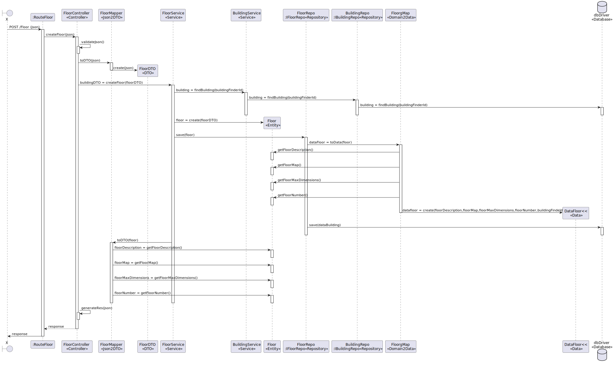

# US 190

## Criar Piso

## 1. Requisitos

### 1.1. Critérios de aceitação do cliente

Criar piso pressupõe a existência de pelo menos um edifício.

Observações: POST


### 1.2 Caderno de encargos


### 1.3 Questões realizadas

Questão:


    Boa tarde, caro cliente.

    É esperado que seja imposto um limite aquando da criação de um piso? Ex: 0 <= andar piso <= 100, De forma a evitar valores irrealistas.

    Relativamente à breve descrição, referida em: https://moodle.isep.ipp.pt/mod/forum/discuss.php?d=25016, existirá alguma restrição quanto ao comprimento da mesma, como é o caso da descrição do edifício?

    Cumprimentos.

    G05.
Resposta:

    bom dia,
    não existem limites. podem existir pisos subteraneos, ex., piso -1.
    a breve descrição é opcional e no máximo terá 250 caracteres

Questão:

    Caro cliente,

    Será possível esclarecer como funcionarão estas user stories? Com a 230 (Carregar mapa do piso) o nosso entendimento foi que as células seriam carregadas já com a criação de salas e pisos, e assim sendo não faria sentido as outras duas user stories, onde é pedido para criar um piso de um edifício e uma sala. Não entendemos o que é pretendido  com as us's 190 e 310.

    Atentamente,

    Grupo 63

Resposta:

      boa tarde,
      o requisito 150 Criar edificio permite criar um edificio, exemplo, edificio "B", com um nome opcional e com uma breve descrição (ex., "departamento de engenharia informática") indicando a dimensão máxima de cada piso em termos de células (ex., 10 x 10)
      o requisito 190 Criar piso permite definir um piso para um dos edificios criados anteriormente, por exemplo, o piso 1 do edificio B com uma breve descrição (ex., "salas TP")
      o requisito 230 Carregar mapa de piso permite ao utlizador fazer upload de um ficheiro descrevendo o mapa de um dado piso. esse ficheiro deve ser validado se tem a estrutura correta e se obdece ao tamanho máximo definido aquando da criação do edificio
      o requisito 310 Criar sala permite definir um sala num dado piso de um edificio, exemplo sala "B310" no 3º piso do edificio B, com uma categorização dessa sala (Gabinete, Anfiteatro, Laboratório, Outro) e uma breve descrição, ex., "Laboratório de Engenharia de Qualidade"

Questão:

    Caro cliente,
    Em relação ao requisito 310, para além do que foi dito, devem também ser especificadas as dimensões e posições das salas dentro do piso? Isso ajudaria a evitar a sobreposição de salas com elevadores e até mesmo com outras salas.


Resposta:

    bom dia
    essa informação é necessária para o sistema como indicado no RFP. pode ser recolhida ao criar a sala no requisito 310 ou pode fazer parte do ficheiro que é carregado no requisito 230

### 1.4 Dependências

Esta User Story tem dependência da User Story 150

## 2. Análise

### 2.1 Piso
```json
{
  "buildingFinderId": "B",
  "floorNumber": 1,
  "floorDescription": "Description of the floor",
  "floorMap": "URL_to_the_floor_map",
  "floorMaxDimensions": {
    "width": 100,
    "length": 20
  }
```
## 3. Design

### 3.1. Diagrama de Sequência

### 3.1.1 Diagrama de Sequência Layer 1

### 3.1.2 Diagrama de Sequência Layer 2

### 3.1.3 Diagrama de Sequência Layer 3


### 3.2. Diagrama de classes


### 3.3. Estrutura dos pedidos e das respostas
Estrutura dos pedidos
```json
{
  "buildingFinderId": "B",
  "floorNumber": 2,
  "floorDescription": "Description of the floor",
  "floorMap": "URL_to_the_floor_map",
  "floorMaxDimensions": {
    "width": 100,
    "length": 20
}

```

Estrutura das respostas
```json
{
  "id": "48ed5784-ed01-4cc2-a6b9-1f9a85cdfc57",
  "buildingFinderId": "B",
  "floorNumber": 2,
  "floorDescription": "Description of the floor",
  "floorMap": "URL_to_the_floor_map",
  "floorMaxDimensions": {
    "width": 100,
    "length": 20
  }
}
```
### 3.4. Testes
Floor
```
import IFloorDTO from '../../../../src/dto/IFloorDTO';
import { Result } from '../../../../src/core/logic/Result';
import { Floor } from '../../../../src/domain/floor/Floor';

describe('Floor Aggregate Root', () => {
  describe('create', () => {
    it('should create a Floor instance successfully', () => {
      const floorDto: IFloorDTO = {
        buildingFinderId: '1',
        floorNumber: 2,
        floorDescription: 'Second floor',
        floorMap: 'map data',
        floorMaxDimensions: { width: 10, length: 20 },
      };
      const floorOrError: Result<Floor> = Floor.create(floorDto);

      expect(floorOrError.isSuccess).toBe(true);
      const floor = floorOrError.getValue();
      expect(floor.buildingFinderId).toBe('1');
      expect(floor.floorNumber.value).toBe(2);
      expect(floor.floorDescription.value).toBe('Second floor');
      expect(floor.floorMap.value).toBe('map data');
      expect(floor.floorMaxDimensions.width).toBe(10);
      expect(floor.floorMaxDimensions.length).toBe(20);
    });
  });
});

```

FloorDescription
```
import FloorDescription from '../../../../src/domain/floor/FloorDescription';
import { Result } from '../../../../src/core/logic/Result';

describe('FloorDescription Value Object', () => {
  describe('create', () => {
    it('should return Result.ok<FloorDescription> when provided a valid description', () => {
      const descriptionOrError: Result<FloorDescription> = FloorDescription.create('This is a valid description.');

      expect(descriptionOrError.isFailure).toBe(true);
      expect(descriptionOrError.isSuccess).toBe(false);
    });

    it('should return Result.fail<FloorDescription> when provided a null description', () => {
      const descriptionOrError: Result<FloorDescription> = FloorDescription.create(null);

      expect(descriptionOrError.isFailure).toBe(true);
      expect(descriptionOrError.error).toBe('Floor description should not over 250.');
    });

    it('should return Result.fail<FloorDescription> when provided an undefined description', () => {
      const descriptionOrError: Result<FloorDescription> = FloorDescription.create(undefined);

      expect(descriptionOrError.isFailure).toBe(true);
      expect(descriptionOrError.error).toBe('Floor description should not over 250.');
    });

    it('should return Result.fail<FloorDescription> when provided an invalid description', () => {
      const descriptionOrError: Result<FloorDescription> = FloorDescription.create('Invalid#Description');

      expect(descriptionOrError.isFailure).toBe(true);
      expect(descriptionOrError.error).toBe('Esta descrição é inválida');
    });
  });
});
```


FloorMap
```
import FloorMap from '../../../../src/domain/floor/FloorMap';
import { Result } from '../../../../src/core/logic/Result';

describe('FloorMap Value Object', () => {
  describe('create', () => {
    it('should return Result.ok<FloorMap> when provided a valid floorMap', () => {
      const floorMapOrError: Result<FloorMap> = FloorMap.create('valid floor map data');

      expect(floorMapOrError.isFailure).toBe(false);
      expect(floorMapOrError.isSuccess).toBe(true);
      expect(floorMapOrError.getValue().value).toBe('valid floor map data');
    });

    it('should return Result.fail<FloorMap> when provided a null floorMap', () => {
      const floorMapOrError: Result<FloorMap> = FloorMap.create(null);

      expect(floorMapOrError.isFailure).toBe(true);
      expect(floorMapOrError.error).toBe('Floor map should not over 255.');
    });

    it('should return Result.fail<FloorMap> when provided an undefined floorMap', () => {
      const floorMapOrError: Result<FloorMap> = FloorMap.create(undefined);

      expect(floorMapOrError.isFailure).toBe(true);
      expect(floorMapOrError.error).toBe('Floor map should not over 255.');
    });
  });
});

```


FloorMaxDimensions
```
import { FloorMaxDimensions } from '../../../../src/domain/floor/FloorMaxDimensions';
import { Result } from '../../../../src/core/logic/Result';

describe('FloorMaxDimensions Value Object', () => {
  describe('create', () => {
    it('should return Result.ok<FloorMaxDimensions> when provided valid width and length', () => {
      const dimensionsOrError: Result<FloorMaxDimensions> = FloorMaxDimensions.create(10, 20);

      expect(dimensionsOrError.isFailure).toBe(false);
      expect(dimensionsOrError.isSuccess).toBe(true);
      expect(dimensionsOrError.getValue().width).toBe(10);
      expect(dimensionsOrError.getValue().length).toBe(20);
    });

    it('should return Result.fail<FloorMaxDimensions> when provided negative width', () => {
      const dimensionsOrError: Result<FloorMaxDimensions> = FloorMaxDimensions.create(-10, 20);

      expect(dimensionsOrError.isFailure).toBe(true);
      expect(dimensionsOrError.error).toBe('Width and Length should be positive values.');
    });

    it('should return Result.fail<FloorMaxDimensions> when provided negative length', () => {
      const dimensionsOrError: Result<FloorMaxDimensions> = FloorMaxDimensions.create(10, -20);

      expect(dimensionsOrError.isFailure).toBe(true);
      expect(dimensionsOrError.error).toBe('Width and Length should be positive values.');
    });
  });

  it('should throw error when updating width with non-positive value', () => {
    const dimensionsOrError: Result<FloorMaxDimensions> = FloorMaxDimensions.create(10, 20);

    // Assuming the creation will succeed for this test
    expect(dimensionsOrError.isSuccess).toBe(true);
    const dimensions = dimensionsOrError.getValue();

    expect(() => {
      dimensions.width = -5;
    }).toThrowError('Width should be a positive value');
  });
});

```


FloorNumber
```
import { Result } from '../../../../src/core/logic/Result';
import FloorNumber from '../../../../src/domain/floor/FloorNumber';

describe('FloorNumber Value Object', () => {
  describe('create', () => {
    it('should return Result.ok<FloorNumber> when provided a valid floornumber', () => {
      const floorNumberOrError: Result<FloorNumber> = FloorNumber.create(5);

      expect(floorNumberOrError.isFailure).toBe(false);
      expect(floorNumberOrError.isSuccess).toBe(true);
      expect(floorNumberOrError.getValue().value).toBe(5);
    });

    it('should return Result.fail<FloorNumber> when provided a null floornumber', () => {
      const floorNumberOrError: Result<FloorNumber> = FloorNumber.create(null);

      expect(floorNumberOrError.isFailure).toBe(true);
      expect(floorNumberOrError.error).toBe('floorNumber should not be null, undefined or empty.');
    });

    it('should return Result.fail<FloorNumber> when provided an undefined floornumber', () => {
      const floorNumberOrError: Result<FloorNumber> = FloorNumber.create(undefined);

      expect(floorNumberOrError.isFailure).toBe(true);
      expect(floorNumberOrError.error).toBe('floorNumber should not be null, undefined or empty.');
    });
  });

  describe('value', () => {
    it('should return the correct floornumber', () => {
      const floorNumber = FloorNumber.create(10);

      // Assuming that the creation will succeed for this test
      expect(floorNumber.isSuccess).toBe(true);
      expect(floorNumber.getValue().value).toBe(10);
    });
  });
});

```


## 4. Implementação

FloorController
```
export default class FloorController implements IFloorController {
  constructor(@Inject(config.services.floor.name) private floorServiceInstance: IFloorService) {}

  public async createFloor(req: Request, res: Response, next: NextFunction) {
    try {
      const floorOrError = (await this.floorServiceInstance.createFloor(req.body as IFloorDTO)) as Result<IFloorDTO>;
      if (floorOrError.isFailure) {
        return res
          .status(402)
          .json(floorOrError.error)
          .send();
      }
      const floorDTO = floorOrError.getValue();
      return res.json(floorDTO).status(201);
    } catch (e) {
      return next(e);
    }
  }
}


```

FloorService
```
export default class FloorService implements IFloorService {
  constructor(@Inject(config.repos.floor.name) private floorRepo: IFloorRepo) {}

  public async getAllFloor(): Promise<Result<Array<IFloorDTO>>> {
    const floors = await this.floorRepo.getAllFloor();

    const IFloorDTO = floors.getValue().map(floor => FloorMapper.toDTO(floor));
    return Result.ok(IFloorDTO);
  }

  public async getFloor(floorCode: string): Promise<Result<IFloorDTO>> {
    try {
      const floor = await this.floorRepo.findByCode(floorCode);

      if (floor === null) {
        return Result.fail<IFloorDTO>('Floor not found');
      } else {
        const floorDTOResult = FloorMapper.toDTO(floor) as IFloorDTO;
        return Result.ok<IFloorDTO>(floorDTOResult);
      }
    } catch (e) {
      throw e;
    }
  }
}


```
## 5. Integração

## 6. Observações
