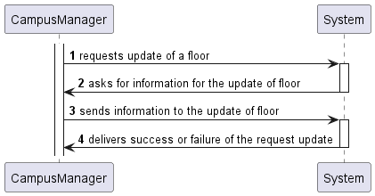
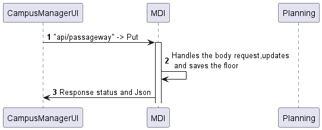
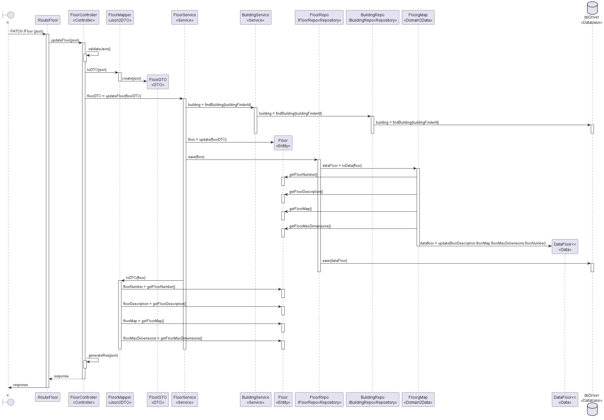

# US 200

## Editar informação do piso do edifício

## 1. Requisitos

### 1.1. Critérios de aceitação do cliente

* Não podemos editar o ID/Code do edifício associado ao floor.

### 1.3 Questões realizadas

Questão:

    Em relação às User Stories de edição, temos já uma ideia das informações que são opcionais, mas queremos ter a certeza daquilo que é editável ou não. Posto isto, poderia indicar que informações pretende editar nas US160, US200, US250 e US280?

Resposta:

    bom dia

    requisito 160 - editar edificio - todas as informações à exceção do código do edificio

    requisito 200 - editar piso - todas as informações à exceção do edificio a que o piso se refere

    requisito 250 - editar passagem - todas as informações

    requisito 280 - editar elevador - todas as informações à exceção do edificio a que o piso se refere

### 1.4 Dependências

  Para editar a informação de um piso, precisamos de ter um edifício criado e um piso criado nesse mesmo edifício.
  Dependência com a US150 e US190.

## 2. Análise

### 2.1 Passagem
```json
{
  "floorDescription": "Updated description for the floor",
  "floorMap": [["R1C1", "R1C2", "R1C3"],["R2C1", "R2C2", "R2C3"],["R3C1", "R3C2", "R3C3"]],
  "floorMaxDimensions": {
    "width": 3,
    "length": 3
  }
}
```
## 3. Design

### 3.1. Diagrama de Sequência

### 3.1.1 Diagrama de Sequência Layer 1

### 3.1.2 Diagrama de Sequência Layer 2

### 3.1.3 Diagrama de Sequência Layer 3



### 3.2. Estrutura dos pedidos e das respostas
Estrutura dos pedidos
```json
{
  "floorDescription": "Updated description for the floor",
  "floorMap": [["R1C1", "R1C2", "R1C3"],["R2C1", "R2C2", "R2C3"],["R3C1", "R3C2", "R3C3"]],
  "floorMaxDimensions": {
    "width": 3,
    "length": 3
  }
}
```
Estrutura das respostas
```json
{
  "id": "653e748a01b8e73b96c02158",
  "buildingFinderId": "B",
  "floorNumber": 2,
  "floorDescription": "Updated description for the floor",
  "floorMap": [
    [
      "R1C1",
      "R1C2",
      "R1C3"
    ],
    [
      "R2C1",
      "R2C2",
      "R2C3"
    ],
    [
      "R3C1",
      "R3C2",
      "R3C3"
    ]
  ],
  "floorMaxDimensions": {
    "width": 3,
    "length": 3
  }
}
```

## 4. Integração
FloorController

    public async updateFloor(req: Request, res: Response, next: NextFunction) {
    const { buildingFinderId, floorNumber } = req.params;
    const floorDTO: IFloorDTO = {
      buildingFinderId: buildingFinderId,
      floorNumber: parseInt(floorNumber),
      floorDescription: req.body.floorDescription,
      floorMap: req.body.floorMap,
      floorMaxDimensions: req.body.floorMaxDimensions,
    };

    try {
      const result = await this.floorServiceInstance.updateFloor(floorDTO);

      if (result.isFailure) {
        return res
          .status(400)
          .json({ error: result.error })
          .send();
      }

      return res
        .status(200)
        .json(result.getValue())
        .send();
    } catch (error) {
      console.error('Error during floor update:', error.message);
      return next(error);
    }
  }

FloorService

    public async updateFloor(floorDTO: IFloorDTO): Promise<Result<IFloorDTO>> {
    try {
      const existingFloor = await this.floorRepo.findFloorByBuildingCodeFloorNumber(
        floorDTO.buildingFinderId,
        floorDTO.floorNumber,
      );

      if (!existingFloor) {
        return Result.fail<IFloorDTO>('Floor with provided floorNumber does not exist for the given buildingFinderId.');
      }

      const building = await this.findBuilding(floorDTO.buildingFinderId);
      if (!building) {
        return Result.fail<IFloorDTO>('Building not found');
      }

      const dimensoes: BuildingSize = building.buildingSize;
      if (
        dimensoes.length < floorDTO.floorMaxDimensions.length ||
        dimensoes.width < floorDTO.floorMaxDimensions.width
      ) {
        return Result.fail<IFloorDTO>('Floor Dimensions are superior to the Building Size.');
      }

      if (floorDTO.floorMap) {
        const mapWidth = floorDTO.floorMap.length;
        const mapHeight = floorDTO.floorMap[0].length;
        if (mapHeight !== floorDTO.floorMaxDimensions.length || mapWidth !== floorDTO.floorMaxDimensions.width) {
          return Result.fail<IFloorDTO>('floorMap dimensions do not match floorMaxDimensions.');
        }
      }

      existingFloor.updateFloorNumber(floorDTO.floorNumber);
      existingFloor.updateFloorDescription(floorDTO.floorDescription);
      existingFloor.updateFloorMap(floorDTO.floorMap);
      existingFloor.updateFloorMaxDimensions(floorDTO.floorMaxDimensions.width, floorDTO.floorMaxDimensions.length);

      await this.floorRepo.save(existingFloor); // Persist the changes to the database

      const floorDTOResult = FloorMapper.toDTO(existingFloor) as IFloorDTO;
      return Result.ok<IFloorDTO>(floorDTOResult);
    } catch (e) {
      console.error('Error during floor update:', e.message);
      throw e;
    }
}
