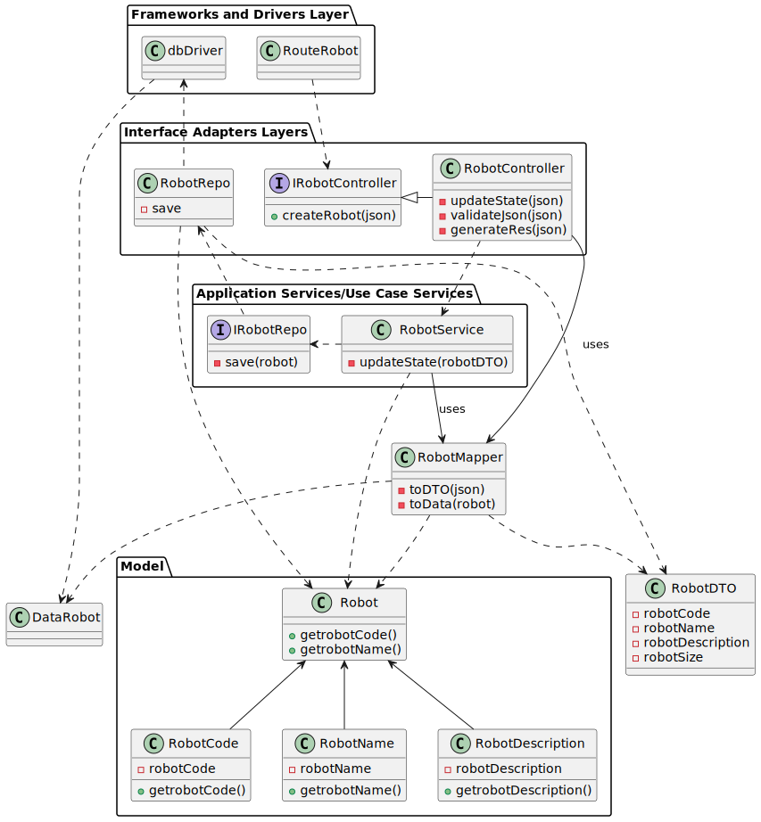

# US380 - LAP-21

## Listar todos os robots

## 1. Requisitos

### 1.1. Critérios de aceitação do cliente

Todos os robots do sistema devem ser listados

### 1.2 Caderno de encargos

N/A

### 1.3 Questões realizadas

N/A


### 1.4 Dependências

Esta User Story tem dependencia com a US360, uma vez que é necessário criar um robot para o poder listar

## 2. Análise

### 2.1 Robot

## 3. Design

### 3.1. Diagrama de sequência

### 3.1.1 Diagrama de Sequência Layer 1

### 3.1.2 Diagrama de Sequência Layer 2

### 3.1.3 Diagrama de Sequência Layer 3


### 3.2. Diagrama de classes



### 3.3. Estrutura dos pedidos e das respostas

Pedido:
Sem body

Resposta:
200:
```json
{
    {
    "robotCode": "exampleCode",
    "robotDescription": "exampleDescription",
    "robotNickname": "exampleNickname",
    "robotSerialNumber": "exampleSerialNumber",
    "robotTypeName": "robotTypeName",
    "enabled": "enabled"
    },
        {
    "robotCode2": "exampleCode2s",
    "robotDescription2": "exampleDescription2",
    "robotNickname2": "exampleNickname2",
    "robotSerialNumber2": "exampleSerialNumber2",
    "robotTypeName2": "robotTypeName",
    "enabled2": "disabled"
    },
}

```
404:
```json
{
    "error": "No Robots were found."
}
```

### 3.4. Testes

## 4. Implementação

## 5. Integração

## 6. Observações